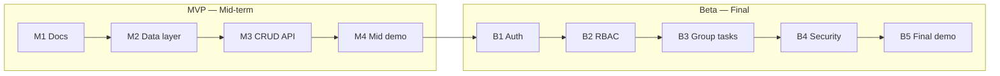

# Product Requirements Document (PRD) — Smarter Todo

| Field | Value |
|---|---|
| Product | Smarter Todo |
| Version | MVP + Beta |
| Releases | MVP — Mid-term, Beta — Final |
| Status | Draft |
| Related docs | [Software Requirements Specification (SRS)](02-srs.md), [Technical Design Document (TDD)](03-tdd.md) |

This document covers **both releases**. Every goal, feature and story has a **Release** column so it is clear what is built for the mid-term and what is added for the final.

**Documents in this set**

| Short form | Full form | Purpose | File |
|---|---|---|---|
| PRD | Product Requirements Document | What we build and why (this document) | [01-prd.md](01-prd.md) |
| SRS | Software Requirements Specification | Exact requirements, permissions and acceptance criteria | [02-srs.md](02-srs.md) |
| TDD | Technical Design Document | How we build it: architecture, data model, API | [03-tdd.md](03-tdd.md) |

## 0. Release plan

| Release | When | Focus |
|---|---|---|
| **MVP** | Mid-term | Core product: task CRUD REST API, database, deployed on Vercel |
| **Beta** | Final | Users and permissions (auth + RBAC), group tasks, security hardening |

## 1. Purpose

Smarter Todo is the successor of Smart Todo. Smart Todo tried to cover a lot (reminders, notifications, analytics, categories) and the docs ended up far ahead of the code. This time we build in two clear steps:

1. **MVP (mid-term):** a small, working **REST API for creating, reading, updating and deleting tasks (CRUD)**, deployed on Vercel.
2. **Beta (final):** turn the MVP into a multi-user product: accounts and login, roles (RBAC), group tasks for teams, and security hardening.

## 2. Problem statement

Students need a simple, reliable place to keep track of their tasks, and when they work in teams (class projects, clubs) they need a shared list where everyone can see and update the same tasks. Their tasks must stay private from other users, and the system must be safe to run in production.

## 3. Goals

| ID | Goal | Release |
|---|---|---|
| G-1 | Provide a REST API for task CRUD that follows standard REST conventions. | MVP |
| G-2 | Store tasks in a database so data survives restarts and redeploys. | MVP |
| G-3 | Document the API automatically (OpenAPI at `/api/docs`). | MVP |
| G-4 | Deploy automatically to Vercel on every push to `main`. | MVP |
| G-5 | Each user has an account and sees only their own personal tasks. | Beta |
| G-6 | Control access with roles: `user` and `admin`. | Beta |
| G-7 | Let users share tasks with a team through groups. | Beta |
| G-8 | Protect accounts and data (hashed passwords, token security, login limits). | Beta |

## 4. Target users

| User | Need | Release |
|---|---|---|
| Student / end user | Add, view, edit, complete and delete tasks. | MVP |
| Frontend developer | A clear, documented API to build the UI on. | MVP |
| Instructor / reviewer | An easy way to try the API (`/api/docs`) and check the code. | MVP |
| Registered user | Private personal task list behind a login, and a simple profile page to change name and password. | Beta |
| Group owner | Create a team group, add and remove members, manage the group. | Beta |
| Group member | See, add and update the group's shared tasks. | Beta |
| Admin | Manage users and roles, see usage stats on a dashboard, ban malicious users, remove unwanted tasks. | Beta |

In the **MVP** there are no accounts: there is one shared task list. In the **Beta** every task belongs to a user or a group.

## 5. Scope

### In scope — MVP (mid-term)
- Create, list (with pagination), view, update (including mark complete) and delete tasks
- Input validation and clear error responses
- Health check endpoint
- Interactive API docs at `/api/docs`
- Automatic deploy to Vercel

### In scope — Beta (final)
- **Auth:** sign up, log in, log out, refresh session (JWT access token + refresh token)
- **User profile:** see my profile, change my name, change my password
- **Personal tasks:** every task belongs to a user; users only see their own
- **RBAC:** `user` and `admin` roles; admin manages users/roles and can remove any task
- **Admin dashboard:** usage stats (users, tasks, groups, recent activity) and ban / unban of malicious users
- **Group tasks:** create a group, add/remove members, shared group task list, assign a task to a member, leave a group
- **Security:** hashed passwords, secure cookies, login attempt limit, security headers, secrets only in env vars

### Out of scope for this semester
- Automated test suite and CI/CD pipeline (GitHub Actions, branch protection) — planned for later
- Search, filtering and sorting
- Categories, priorities, subtasks
- Reminders, notifications, analytics, calendar
- Email verification, password reset, social login, changing email
- Transferring group ownership

## 6. Features and priority (MoSCoW)

Priorities are per release: a Beta "Must" is required for the final, not for the mid-term.

| ID | Feature | Release | Priority |
|---|---|---|---|
| F-1 | Create task | MVP | Must |
| F-2 | List tasks | MVP | Must |
| F-3 | Get task by ID | MVP | Must |
| F-4 | Update task (title, description, due date, completed) | MVP | Must |
| F-5 | Delete task | MVP | Must |
| F-6 | Validation and error responses | MVP | Must |
| F-7 | Health check | MVP | Must |
| F-8 | Pagination on list (`offset`, `limit`) | MVP | Should |
| F-9 | Simple React page that uses the API | MVP | Could |
| F-10 | Sign up, log in, log out, refresh session | Beta | Must |
| F-11 | Personal tasks (owned by a user, private) | Beta | Must |
| F-12 | Roles `user` / `admin` with permission checks | Beta | Must |
| F-13 | Admin: list users, change role, view/delete any task | Beta | Should |
| F-14 | Groups: create, rename, delete, list my groups | Beta | Must |
| F-15 | Group members: add by email, remove, leave | Beta | Must |
| F-16 | Group tasks: shared list, assign to a member | Beta | Must |
| F-17 | Security hardening (hashing, cookies, login limit, headers) | Beta | Must |
| F-18 | React pages for login, my tasks and groups | Beta | Could |
| F-19 | Admin dashboard: usage stats API + admin page | Beta | Should |
| F-20 | Ban / unban users (banned users cannot log in or use the API) | Beta | Must |
| F-21 | User profile: view profile, change name, change password | Beta | Should |

## 7. User stories

### MVP

| ID | Story | Feature |
|---|---|---|
| US-01 | As a user, I want to add a task with a title, so I can remember what to do. | F-1 |
| US-02 | As a user, I want to see all my tasks, so I know what is pending. | F-2, F-8 |
| US-03 | As a user, I want to open one task, so I can see its details. | F-3 |
| US-04 | As a user, I want to edit a task, so I can fix or update it. | F-4 |
| US-05 | As a user, I want to mark a task as completed, so I can track progress. | F-4 |
| US-06 | As a user, I want to delete a task, so my list stays clean. | F-5 |
| US-07 | As a client developer, I want clear error messages, so I know what went wrong. | F-6 |
| US-08 | As a maintainer, I want a health endpoint, so I can check the deploy is running. | F-7 |

### Beta

| ID | Story | Feature |
|---|---|---|
| US-09 | As a visitor, I want to sign up with my email and a password, so I get my own task list. | F-10 |
| US-10 | As a user, I want to log in and log out, so only I can use my account. | F-10 |
| US-11 | As a user, I want to see only my own personal tasks, so my list stays private. | F-11 |
| US-12 | As an admin, I want to list users and change their role, so I can manage who is an admin. | F-12, F-13 |
| US-13 | As an admin, I want to view and delete any task, so I can remove unwanted content. | F-12, F-13 |
| US-14 | As a user, I want to create a group for my class project, so my team has a shared task list. | F-14 |
| US-15 | As a group owner, I want to add and remove members by email, so I control who is in the team. | F-15 |
| US-16 | As a group member, I want to see and add tasks in the group, so the team works from one list. | F-16 |
| US-17 | As a group member, I want to assign a task to a teammate, so everyone knows who does what. | F-16 |
| US-18 | As a group member, I want to leave a group, so it no longer appears in my list. | F-15 |
| US-19 | As a user, I want my password stored safely and repeated wrong logins blocked, so my account is hard to break into. | F-17 |
| US-20 | As an admin, I want a dashboard with stats (users, tasks, groups, new sign-ups), so I can see how the app is used. | F-19 |
| US-21 | As an admin, I want to ban a malicious user with a reason, so they are logged out and cannot use the app. | F-20 |
| US-22 | As an admin, I want to unban a user, so I can restore access after a mistake or an appeal. | F-20 |
| US-23 | As a user, I want a profile page showing my name, email and role, so I can see my account details. | F-21 |
| US-24 | As a user, I want to change my name and my password, so I can keep my account up to date and secure. | F-21 |

## 8. Success metrics

### MVP
- All five CRUD endpoints work on the production Vercel URL.
- Data is still there after a redeploy.
- `/api/docs` lists every endpoint with request and response schemas.

### Beta
- A user can never read, change or delete another user's personal task.
- Every endpoint enforces the permission matrix in the [SRS, section 3.9](02-srs.md#39-permission-matrix--beta).
- Group members can work on the same task list; non-members cannot see the group.
- Passwords are never stored or returned in plain text.
- A banned user is blocked on their very next request, not only at their next login.

## 9. Assumptions and constraints

- Hosted on Vercel (frontend and FastAPI backend in one project, see `vercel.json`).
- Vercel functions are serverless, so data must live in an external database (Supabase PostgreSQL), not a local file.
- Backend: Python 3.10+, FastAPI. Frontend: Vite + React + TypeScript.
- The first admin is promoted manually (role set in the Supabase table editor); after that admins manage roles through the API.
- MVP data is demo data; it does not need to be kept when the Beta adds user ownership.

## 10. Milestones

### MVP — Mid-term

| Milestone | Deliverable |
|---|---|
| M1 — Docs | [PRD](01-prd.md), [SRS](02-srs.md) and [TDD](03-tdd.md) (covering MVP and Beta) approved |
| M2 — Data layer | Task model and database connection |
| M3 — API | Five CRUD endpoints with validation |
| M4 — Mid demo | Live on Vercel, tagged `v0.1.0` (MVP) |

### Beta — Final

| Milestone | Deliverable |
|---|---|
| B1 — Auth | Sign up, login, logout, refresh, user profile (change name and password); tasks owned by a user; Alembic migrations in place |
| B2 — RBAC + admin | `user` and `admin` roles, admin endpoints, admin dashboard stats, ban / unban, permission checks on every endpoint |
| B3 — Group tasks | Groups, members, shared group tasks with assignee |
| B4 — Security | Password hashing, secure cookies, login attempt limit, security headers, secret review |
| B5 — Final demo | Beta live on Vercel, tagged `v0.2.0` (Beta) |

## 11. Release dependencies

- The Beta is built on top of the MVP: the same `/api/v1/tasks` endpoints stay, but in the Beta they require login and only return the caller's own tasks.
- Database migrations (Alembic) are introduced at the start of the Beta so the schema can grow from one table to five without manual SQL.
