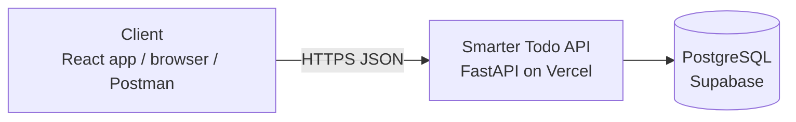
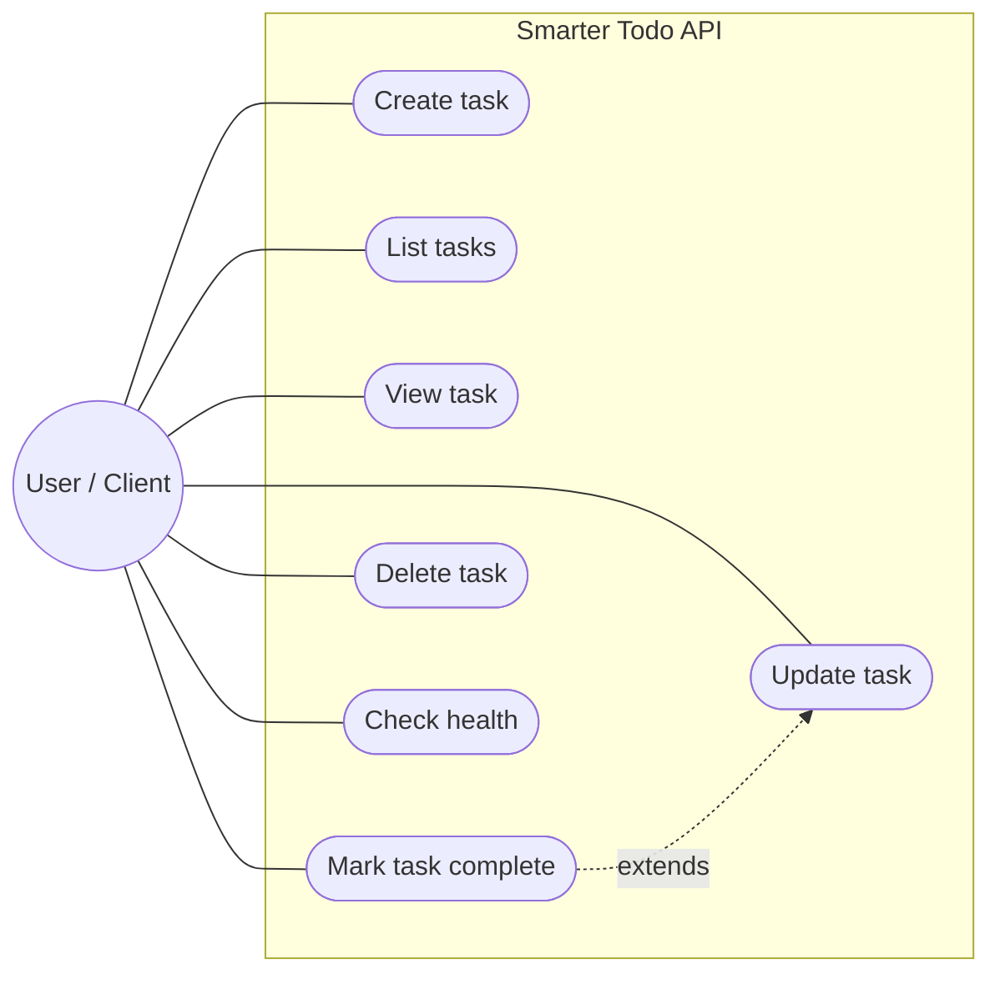
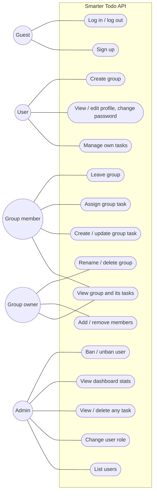
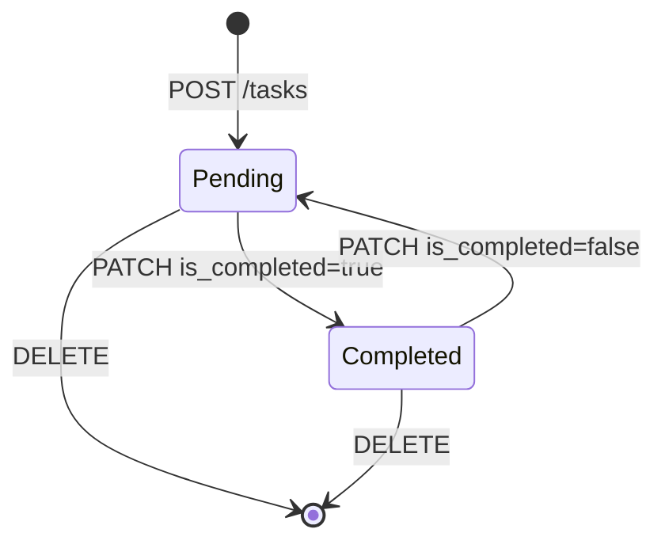

# Software Requirements Specification (SRS) — Smarter Todo

| Field | Value |
|---|---|
| Product | Smarter Todo |
| Version | MVP + Beta |
| Releases | MVP — Mid-term, Beta — Final |
| Status | Draft |
| Related docs | [Product Requirements Document (PRD)](01-prd.md), [Technical Design Document (TDD)](03-tdd.md) |

Every requirement has a **Release** column: **MVP** is built for the mid-term, **Beta** is added for the final.

**Documents in this set**

| Short form | Full form | Purpose | File |
|---|---|---|---|
| PRD | Product Requirements Document | What we build and why | [01-prd.md](01-prd.md) |
| SRS | Software Requirements Specification | Exact requirements, permissions and acceptance criteria (this document) | [02-srs.md](02-srs.md) |
| TDD | Technical Design Document | How we build it: architecture, data model, API | [03-tdd.md](03-tdd.md) |

## 1. Introduction

### 1.1 Purpose
This document lists the requirements for Smarter Todo: the MVP (task CRUD REST API) and the Beta (accounts, roles, group tasks and security), deployed on Vercel.

### 1.2 Scope
- **MVP:** a client can create, list, view, update and delete tasks over HTTP. There are no accounts; all tasks are in one shared list.
- **Beta:** users sign up and log in, see only their own personal tasks, can share tasks with a team through groups, and admins manage users and roles.
- Out of scope: see [PRD, section 5](01-prd.md#5-scope).

### 1.3 Definitions

| Term | Meaning |
|---|---|
| CRUD | Create, Read, Update, Delete |
| REST | API style where resources (like `tasks`) are accessed with HTTP methods (GET, POST, PATCH, DELETE) |
| Task | A to-do item with a title, optional description, optional due date and a completed flag |
| Personal task | (Beta) A task that belongs to one user and is visible only to that user (and admins) |
| Group | (Beta) A named team, such as a class project group, with members and a shared task list |
| Group task | (Beta) A task that belongs to a group and is visible to all its members |
| RBAC | Role-Based Access Control: what a caller can do depends on their role |
| JWT | JSON Web Token: a signed token that proves who the caller is |
| Access token | (Beta) Short-lived JWT sent in the `Authorization: Bearer` header |
| Refresh token | (Beta) Long-lived random token in an HttpOnly cookie, used to get a new access token |
| Client | Anything that calls the API: the React frontend, `/api/docs`, curl, Postman |
| OpenAPI | Standard API description; FastAPI generates it and shows it at `/api/docs` |

## 2. Overall description

### 2.1 System context

### 2.2 Users and roles

| Role | Release | Description |
|---|---|---|
| Anonymous client | MVP | Anyone who can reach the API; full access to the shared task list |
| Guest | Beta | Not logged in; can only sign up, log in, check health and read the API docs |
| User | Beta | Logged in; manages own personal tasks; can create and join groups |
| Admin | Beta | A user with extra rights: dashboard stats, list users, change roles, ban / unban users, view and delete any task |
| Group owner | Beta | Per-group role of the user who created the group: rename/delete the group, add/remove members |
| Group member | Beta | Per-group role: view, create and update the group's tasks |

`user` and `admin` are **global** roles (stored on the user). `owner` and `member` are **per-group** roles (stored on the membership), so the same person can own one group and be a member of another.

### 2.3 Use cases

**MVP**

**Beta**

Every Admin, Group owner and Group member is also a User, so they can do everything a User can.

### 2.4 Constraints
- C-1: Runs on Vercel serverless functions (no local disk that survives between requests).
- C-2: Backend in Python 3.10+ with FastAPI.
- C-3: All API routes start with `/api`, because `vercel.json` sends `/api/*` to the backend.
- C-4: Requests and responses use JSON.
- C-5: Production database is Supabase PostgreSQL; local development uses SQLite.
- C-6: (Beta) Login is implemented in our own API (no third-party login providers).

### 2.5 Assumptions
- A-1: A hosted database is available to the Vercel project through an environment variable.
- A-2: The app is used for demos and class work, so traffic is low.
- A-3: (Beta) The first admin is promoted manually in the Supabase table editor.
- A-4: (Beta) MVP tasks are demo data and may be removed when tasks get an owner.

## 3. Functional requirements

### 3.1 Tasks — MVP

| ID | Requirement | Release | Story |
|---|---|---|---|
| FR-01 | The system shall create a task from a JSON body with `title` (required), `description`, `due_date` (optional). New tasks have `is_completed = false`. | MVP | US-01 |
| FR-02 | The system shall return the list of tasks, newest first. | MVP | US-02 |
| FR-03 | The list shall support `offset` (default 0) and `limit` (default 20, max 100) query parameters. | MVP | US-02 |
| FR-04 | The system shall return one task by its ID. | MVP | US-03 |
| FR-05 | The system shall update any of `title`, `description`, `due_date`, `is_completed` on an existing task. Fields not sent stay unchanged. | MVP | US-04, US-05 |
| FR-06 | The system shall delete a task by its ID. | MVP | US-06 |
| FR-07 | The system shall set `created_at` when a task is created and update `updated_at` on every change. | MVP | US-04 |
| FR-08 | The system shall reject invalid input with status `422` and a message saying which field is wrong. | MVP | US-07 |
| FR-09 | The system shall return `404` when a task ID does not exist. | MVP | US-07 |
| FR-10 | The system shall expose `GET /api/health` returning `{"status": "ok"}`. | MVP | US-08 |
| FR-11 | The system shall publish interactive API docs at `/api/docs`. | MVP | US-07 |

### 3.2 Authentication and profile — Beta

| ID | Requirement | Release | Story |
|---|---|---|---|
| FR-12 | The system shall let a guest sign up with `email`, `name` and `password`. Email is unique (case-insensitive); a duplicate returns `409`. New users get role `user`. | Beta | US-09 |
| FR-13 | The system shall log a user in with email and password, returning an access token in the body and setting a refresh token cookie. Wrong email or password returns `401` with the same message for both. | Beta | US-10 |
| FR-14 | The system shall issue a new access token when called with a valid refresh token cookie, and replace (rotate) the refresh token. | Beta | US-10 |
| FR-15 | The system shall log a user out by revoking the refresh token and clearing the cookie. | Beta | US-10 |
| FR-16 | The system shall return the logged-in user's profile (`id`, `email`, `name`, `role`). The password hash is never returned. | Beta | US-10 |
| FR-17 | In the Beta, every task, group, user and admin endpoint shall require a valid access token; otherwise it returns `401`. | Beta | US-11 |
| FR-40 | A user shall be able to change their own `name`. Email and role cannot be changed through the profile. | Beta | US-23, US-24 |
| FR-41 | A user shall be able to change their password by sending the current and the new password. A wrong current password returns `400`. On success all the user's sessions (refresh tokens) are revoked and they log in again. | Beta | US-24 |

### 3.3 Personal tasks — Beta

| ID | Requirement | Release | Story |
|---|---|---|---|
| FR-18 | A task created through `/api/v1/tasks` shall belong to the caller (personal task). The list returns only the caller's personal tasks. | Beta | US-11 |
| FR-19 | Reading, updating or deleting another user's personal task shall return `404`, so the task's existence is not revealed. | Beta | US-11 |

### 3.4 Roles (RBAC) and admin — Beta

| ID | Requirement | Release | Story |
|---|---|---|---|
| FR-20 | Every user shall have exactly one global role: `user` or `admin`. | Beta | US-12 |
| FR-21 | An admin shall be able to list all users (paginated). | Beta | US-12 |
| FR-22 | An admin shall be able to change another user's role. An admin cannot change their own role (`400`), so the system always keeps at least one admin. | Beta | US-12 |
| FR-23 | An admin shall be able to list all tasks (personal and group) and delete any task. | Beta | US-13 |
| FR-24 | A non-admin calling an admin endpoint shall get `403`. | Beta | US-12, US-13 |
| FR-35 | An admin shall be able to view dashboard stats: total users, admins, banned users, new users in the last 7 days, total / completed tasks, tasks created in the last 7 days, and total groups. | Beta | US-20 |
| FR-36 | An admin shall be able to ban a user with an optional reason. Banning revokes all the user's refresh tokens. An admin cannot ban themself or another admin (`400`); demote the admin first. | Beta | US-21 |
| FR-37 | A banned user shall get `403` ("Account banned") on login and on every authenticated request, even with an access token that has not expired yet. | Beta | US-21 |
| FR-38 | An admin shall be able to unban a user; the user can then log in again. The user's tasks and group memberships are kept while banned. | Beta | US-22 |
| FR-39 | The admin user list shall show each user's status (`active` / `banned`), ban date and ban reason. | Beta | US-21 |

### 3.5 Groups and group tasks — Beta

| ID | Requirement | Release | Story |
|---|---|---|---|
| FR-25 | Any user shall be able to create a group with a `name`. The creator becomes the group's `owner`. | Beta | US-14 |
| FR-26 | A user shall be able to list the groups they belong to. | Beta | US-14 |
| FR-27 | The owner shall be able to rename or delete the group. Deleting a group deletes its tasks and memberships. | Beta | US-14 |
| FR-28 | The owner shall be able to add a member by email. Unknown email returns `404`; an existing member returns `409`. | Beta | US-15 |
| FR-29 | The owner shall be able to remove a member. A member shall be able to leave. The owner cannot leave (they delete the group instead). | Beta | US-15, US-18 |
| FR-30 | Group members shall be able to list, create, view and update the group's tasks. | Beta | US-16 |
| FR-31 | A group task may have an `assignee_id`, which must be a member of the group (`422` otherwise). When a member leaves or is removed, their assigned tasks in that group become unassigned. | Beta | US-17 |
| FR-32 | A group task can be deleted by its creator or by the group owner. | Beta | US-16 |
| FR-33 | A user who is not a member of a group shall get `404` for that group and its tasks. | Beta | US-16 |

### 3.6 Account security — Beta

| ID | Requirement | Release | Story |
|---|---|---|---|
| FR-34 | After 5 failed logins in a row for an email, the system shall block logins for that account for 15 minutes and return `429`. A successful login resets the counter. | Beta | US-19 |

### 3.7 Validation rules

| Field | Rule | Release |
|---|---|---|
| `title` | Required on create, string, 1–200 characters after trimming spaces | MVP |
| `description` | Optional, string, max 1000 characters | MVP |
| `due_date` | Optional, date in `YYYY-MM-DD` format | MVP |
| `is_completed` | Boolean | MVP |
| `offset` | Integer ≥ 0 | MVP |
| `limit` | Integer 1–100 | MVP |
| `email` | Valid email, max 254 characters, stored lowercase | Beta |
| `name` (user) | 1–100 characters | Beta |
| `password` | 8–128 characters | Beta |
| `name` (group) | 1–100 characters | Beta |
| `role` | `user` or `admin` | Beta |
| `reason` (ban) | Optional, max 500 characters | Beta |
| `assignee_id` | Optional; must be a member of the task's group | Beta |

### 3.8 Task states

A new task always starts as `Pending` (`is_completed = false`). Editing other fields does not change the state. The same states apply to personal and group tasks.

### 3.9 Permission matrix — Beta

| Action | Guest | User | Group member | Group owner | Admin |
|---|---|---|---|---|---|
| Sign up, log in | Yes | — | — | — | — |
| Log out, view own profile, change own name and password | No | Yes | Yes | Yes | Yes |
| CRUD own personal tasks | No | Yes | Yes | Yes | Yes |
| Read/update another user's personal task | No | No (`404`) | No (`404`) | No (`404`) | Read only (via admin list) |
| Delete any task | No | No | No | No | Yes |
| List users, change roles | No | No (`403`) | No (`403`) | No (`403`) | Yes |
| View dashboard stats, ban / unban users | No | No (`403`) | No (`403`) | No (`403`) | Yes (not self, not other admins) |
| Create a group | No | Yes | Yes | Yes | Yes |
| View group, members and group tasks | No | No (`404`) | Yes | Yes | No (`404`) unless member |
| Create / update / assign group tasks | No | No (`404`) | Yes | Yes | No (`404`) unless member |
| Delete a group task | No | No | Own tasks only | Yes | Yes (admin endpoint) |
| Rename / delete group, add / remove members | No | No | No (`403`) | Yes | No |
| Leave group | No | — | Yes | No (delete instead) | — |

"User" means a logged-in user who is not a member of the group in that row.

### 3.10 Status codes

| Case | Code | Release |
|---|---|---|
| Resource created | `201 Created` | MVP |
| Read or update succeeded | `200 OK` | MVP |
| Deleted / logged out | `204 No Content` | MVP |
| Validation failed | `422 Unprocessable Content` | MVP |
| Resource not found, or caller may not know it exists | `404 Not Found` | MVP |
| Unexpected server error | `500 Internal Server Error` | MVP |
| Bad request (e.g. admin changing own role) | `400 Bad Request` | Beta |
| Missing, invalid or expired token; wrong login | `401 Unauthorized` | Beta |
| Logged in but role not allowed, or account banned | `403 Forbidden` | Beta |
| Duplicate (email taken, already a member) | `409 Conflict` | Beta |
| Too many failed logins | `429 Too Many Requests` | Beta |

## 4. Non-functional requirements

| ID | Category | Requirement | Release |
|---|---|---|---|
| NFR-01 | Performance | 95% of task requests answer in under 500 ms (excluding a cold start). | MVP |
| NFR-02 | Persistence | Data is stored in a database and is not lost on redeploy or restart. | MVP |
| NFR-03 | Availability | The production API is reachable on the Vercel URL during the semester. | MVP |
| NFR-04 | Security | All traffic uses HTTPS (provided by Vercel). | MVP |
| NFR-05 | Security | Database credentials and secrets are stored only in Vercel environment variables, never in Git. | MVP |
| NFR-06 | Security | Database queries use the ORM with parameters, never string-built SQL. | MVP |
| NFR-07 | Security | Error responses do not expose stack traces or database details. | MVP |
| NFR-08 | Maintainability | Code is split into layers: routes, schemas, models, database. | MVP |
| NFR-09 | Usability (API) | Every endpoint is listed in `/api/docs` with request and response schemas. | MVP |
| NFR-10 | Deployability | The app runs on Vercel; a push to `main` updates production. | MVP |
| NFR-11 | Security | Passwords are hashed with Argon2; plain passwords are never stored, logged or returned. | Beta |
| NFR-12 | Security | Access tokens are JWTs signed with a secret of at least 32 bytes from an env var, valid for 15 minutes. | Beta |
| NFR-13 | Security | Refresh tokens are random, valid for 7 days, stored only as a hash, and replaced on every refresh. | Beta |
| NFR-14 | Security | The refresh token cookie is `HttpOnly`, `Secure`, `SameSite=Strict` and limited to path `/api/v1/auth`. | Beta |
| NFR-15 | Security | Frontend and API share one origin, so CORS stays disabled (no cross-origin access). | Beta |
| NFR-16 | Security | Responses include security headers: `X-Content-Type-Options`, `X-Frame-Options`, `Referrer-Policy`, `Strict-Transport-Security`. | Beta |
| NFR-17 | Security | Every permission check runs on the server for every request; the frontend hiding a button is never the only protection. | Beta |
| NFR-18 | Performance | Sign up and login answer in under 1 s (password hashing is slow on purpose). | Beta |
| NFR-19 | Maintainability | Database schema changes are made through Alembic migrations, not by hand. | Beta |

## 5. Acceptance criteria

### MVP

**AC-01 Create task (FR-01, FR-07)**
- Given a valid body `{"title": "Read chapter 3"}`
- When the client sends `POST /api/v1/tasks`
- Then the response is `201` with an `id`, `is_completed: false`, and `created_at` set.

**AC-02 Create task with no title (FR-08)**
- Given a body `{}` or `{"title": ""}`
- When the client sends `POST /api/v1/tasks`
- Then the response is `422` and mentions `title`.

**AC-03 List tasks (FR-02, FR-03)**
- Given 25 tasks exist
- When the client sends `GET /api/v1/tasks?limit=10&offset=0`
- Then the response is `200` with 10 tasks, newest first.

**AC-04 Get task (FR-04, FR-09)**
- Given task `5` exists
- When the client sends `GET /api/v1/tasks/5`, the response is `200` with that task.
- When the client sends `GET /api/v1/tasks/9999`, the response is `404`.

**AC-05 Update task (FR-05, FR-07)**
- Given task `5` exists with `is_completed: false`
- When the client sends `PATCH /api/v1/tasks/5` with `{"is_completed": true}`
- Then the response is `200`, `is_completed` is `true`, the title is unchanged, and `updated_at` is newer.

**AC-06 Delete task (FR-06, FR-09)**
- Given task `5` exists
- When the client sends `DELETE /api/v1/tasks/5`
- Then the response is `204`, and a following `GET /api/v1/tasks/5` returns `404`.

**AC-07 Health (FR-10)**
- When the client sends `GET /api/health`
- Then the response is `200` with `{"status": "ok"}`.

### Beta

**AC-08 Sign up (FR-12)**
- Given no account exists for `a@x.com`
- When a guest signs up with that email, the response is `201` with role `user` and no password field.
- When anyone signs up again with `A@x.com`, the response is `409`.

**AC-09 Log in (FR-13)**
- Given user `a@x.com` exists
- When they log in with the right password, the response is `200` with an `access_token`, and a `refresh_token` cookie is set.
- When they log in with a wrong password, the response is `401`.

**AC-10 Token required (FR-17)**
- When a client calls `GET /api/v1/tasks` without a token, or with an expired one
- Then the response is `401`.

**AC-11 Private personal tasks (FR-18, FR-19)**
- Given user A owns task `5`
- When user B sends `GET`, `PATCH` or `DELETE /api/v1/tasks/5`
- Then the response is `404`, and A's task is unchanged.

**AC-12 Admin only (FR-21, FR-24)**
- When a `user` calls `GET /api/v1/admin/users`, the response is `403`.
- When an `admin` calls it, the response is `200` with the user list.

**AC-13 Change role (FR-22)**
- When an admin sets user B's role to `admin`, the response is `200` and B can now call admin endpoints.
- When an admin tries to change their own role, the response is `400`.

**AC-14 Create group (FR-25, FR-26)**
- When user A creates group "CSE 101 Project"
- Then the response is `201`, A is the group's `owner`, and the group appears in A's `GET /api/v1/groups`.

**AC-15 Non-member cannot see group (FR-33)**
- Given user C is not in group `3`
- When C sends `GET /api/v1/groups/3/tasks`
- Then the response is `404`.

**AC-16 Assign group task (FR-31)**
- Given B is a member of group `3` and C is not
- When a member assigns a group task to B, the response is `200`.
- When a member assigns it to C, the response is `422`.

**AC-17 Login lockout (FR-34)**
- Given 5 failed logins in a row for `a@x.com`
- When the right password is sent within 15 minutes
- Then the response is `429`; after 15 minutes the login succeeds.

**AC-18 Dashboard stats (FR-35)**
- Given 10 users (1 banned) and 40 tasks (15 completed)
- When an admin sends `GET /api/v1/admin/stats`
- Then the response is `200` with `users.total = 10`, `users.banned = 1`, `tasks.total = 40`, `tasks.completed = 15`.
- When a `user` sends it, the response is `403`.

**AC-19 Ban user (FR-36, FR-37)**
- Given user B is logged in with a valid access token
- When an admin bans B with reason "spam"
- Then B's next request with the same access token returns `403`, B's refresh fails, and B's login returns `403`.
- When an admin tries to ban themself or another admin, the response is `400`.

**AC-20 Unban user (FR-38)**
- Given user B is banned
- When an admin unbans B
- Then B can log in again and still sees their old tasks.

**AC-21 Edit profile (FR-40)**
- When a user sends `PATCH /api/v1/users/me` with `{"name": "Sayef R."}`
- Then the response is `200` with the new name, and `email` and `role` are unchanged.

**AC-22 Change password (FR-41)**
- When a user sends the wrong `current_password`, the response is `400`.
- When they send the right one and a valid `new_password`, the response is `204`, their refresh fails, and they can log in only with the new password.

## 6. Traceability

| Story | Requirements | Endpoint (see [TDD, section 6](03-tdd.md#6-rest-api-design)) | Release |
|---|---|---|---|
| US-01 | FR-01, FR-07 | `POST /api/v1/tasks` | MVP |
| US-02 | FR-02, FR-03 | `GET /api/v1/tasks` | MVP |
| US-03 | FR-04 | `GET /api/v1/tasks/{id}` | MVP |
| US-04, US-05 | FR-05, FR-07 | `PATCH /api/v1/tasks/{id}` | MVP |
| US-06 | FR-06 | `DELETE /api/v1/tasks/{id}` | MVP |
| US-07 | FR-08, FR-09, FR-11 | All, `/api/docs` | MVP |
| US-08 | FR-10 | `GET /api/health` | MVP |
| US-09 | FR-12 | `POST /api/v1/auth/signup` | Beta |
| US-10 | FR-13 – FR-16 | `/api/v1/auth/login`, `/refresh`, `/logout`, `GET /api/v1/users/me` | Beta |
| US-11 | FR-17 – FR-19 | `/api/v1/tasks` (all) | Beta |
| US-12 | FR-20 – FR-22, FR-24 | `GET /api/v1/admin/users`, `PATCH /api/v1/admin/users/{id}/role` | Beta |
| US-13 | FR-23, FR-24 | `GET /api/v1/admin/tasks`, `DELETE /api/v1/admin/tasks/{id}` | Beta |
| US-14 | FR-25 – FR-27 | `/api/v1/groups`, `/api/v1/groups/{id}` | Beta |
| US-15 | FR-28, FR-29 | `/api/v1/groups/{id}/members` | Beta |
| US-16 | FR-30, FR-32, FR-33 | `/api/v1/groups/{id}/tasks` | Beta |
| US-17 | FR-31 | `PATCH /api/v1/groups/{id}/tasks/{task_id}` | Beta |
| US-18 | FR-29 | `DELETE /api/v1/groups/{id}/members/{user_id}` | Beta |
| US-19 | FR-34, NFR-11 – NFR-14 | `POST /api/v1/auth/login` | Beta |
| US-20 | FR-35 | `GET /api/v1/admin/stats` | Beta |
| US-21 | FR-36, FR-37, FR-39 | `POST /api/v1/admin/users/{id}/ban`, `GET /api/v1/admin/users` | Beta |
| US-22 | FR-38 | `POST /api/v1/admin/users/{id}/unban` | Beta |
| US-23, US-24 | FR-16, FR-40, FR-41 | `GET` / `PATCH /api/v1/users/me`, `POST /api/v1/users/me/password` | Beta |
